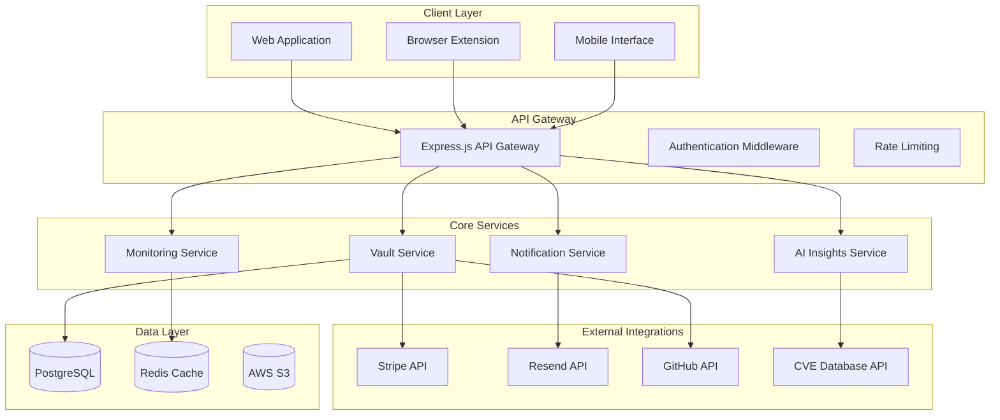
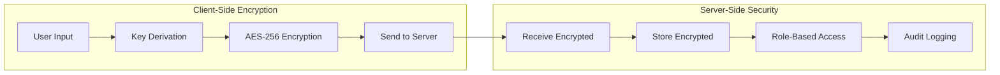
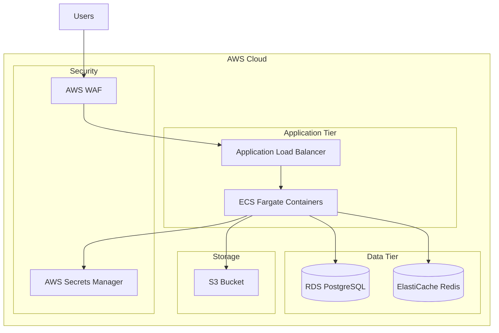

# KeyHaven Pro - Design Document

## Overview

KeyHaven Pro is a secure, AI-powered API key management platform built as a responsive web application with optional browser extension. The system employs client-side encryption, automated monitoring, and intelligent insights to provide enterprise-grade security for individual developers and small teams. The architecture prioritizes security, scalability, and developer experience while maintaining the flexibility needed for rapid iteration during the hackathon timeline.

## Architecture

### High-Level Architecture



### Security Architecture



## Components and Interfaces

### 1. Frontend Components

#### Web Application (React.js)
- **Dashboard Component**: Main interface showing key overview, health scores, and recent activity
- **Vault Component**: Secure key storage interface with drag-and-drop functionality
- **Analytics Component**: Charts and visualizations for key usage and security metrics
- **Team Management Component**: RBAC interface for team collaboration
- **Settings Component**: User preferences, integrations, and security settings

#### Browser Extension
- **Content Script**: Detects API key input fields on service dashboards
- **Popup Interface**: Quick actions for key import/export
- **Background Script**: Secure communication with main application

### 2. Backend Services

#### API Gateway (FastAPI + Python)
```python
from fastapi import FastAPI, Depends, HTTPException
from pydantic import BaseModel
from typing import Optional, List

class APIGateway:
    def __init__(self):
        self.app = FastAPI(title="KeyHaven Pro API", version="1.0.0")
    
    async def authenticate(self, token: str) -> dict:
        """Authenticate user and return user context"""
        pass
    
    async def rate_limit(self, endpoint: str, user_id: str) -> bool:
        """Check rate limiting for user and endpoint"""
        pass
    
    async def log_activity(self, activity: dict) -> None:
        """Log user activity for audit purposes"""
        pass
```

#### Vault Service
```python
from cryptography.fernet import Fernet
from pydantic import BaseModel
from typing import Optional
import uuid

class EncryptedAPIKey(BaseModel):
    id: str
    encrypted_value: str
    iv: str
    salt: str
    service: str
    metadata: dict

class VaultService:
    def __init__(self, db_session):
        self.db = db_session
    
    async def store_key(self, encrypted_key: EncryptedAPIKey, metadata: dict) -> str:
        """Store encrypted API key with metadata"""
        pass
    
    async def retrieve_key(self, key_id: str, user_id: str) -> Optional[EncryptedAPIKey]:
        """Retrieve encrypted key for authorized user"""
        pass
    
    async def rotate_key(self, key_id: str, new_key: str) -> dict:
        """Rotate API key and update connected services"""
        pass
    
    async def delete_key(self, key_id: str, user_id: str) -> bool:
        """Securely delete API key"""
        pass
```

#### Monitoring Service
```python
from datetime import datetime
from typing import List
import asyncio

class MonitoringService:
    def __init__(self, redis_client, db_session):
        self.redis = redis_client
        self.db = db_session
    
    async def track_usage(self, key_id: str, usage_event: dict) -> None:
        """Track API key usage patterns"""
        pass
    
    async def detect_anomalies(self, key_id: str) -> List[dict]:
        """Detect unusual usage patterns"""
        pass
    
    async def schedule_rotation(self, key_id: str, schedule: dict) -> None:
        """Schedule automatic key rotation"""
        pass
    
    async def generate_health_score(self, key_id: str) -> int:
        """Calculate key health score based on usage and security metrics"""
        pass
```

#### AI Insights Service
```python
import openai
from typing import List, Dict
import requests

class AIInsightsService:
    def __init__(self, openai_api_key: str):
        self.openai_client = openai.OpenAI(api_key=openai_api_key)
    
    async def process_natural_language_query(self, query: str, context: dict) -> dict:
        """Process natural language queries about API keys"""
        pass
    
    async def generate_security_insights(self, keys: List[dict]) -> List[dict]:
        """Generate AI-powered security insights"""
        pass
    
    async def predict_risks(self, usage_patterns: List[dict]) -> List[dict]:
        """Predict potential security risks"""
        pass
    
    async def recommend_actions(self, insights: List[dict]) -> List[dict]:
        """Recommend security actions based on insights"""
        pass
```

### 3. External Integration Interfaces

#### Stripe Integration
```python
import stripe
from typing import Dict, Optional

class StripeService:
    def __init__(self, api_key: str):
        stripe.api_key = api_key
    
    async def create_customer(self, user: dict) -> str:
        """Create Stripe customer for user"""
        customer = stripe.Customer.create(
            email=user['email'],
            metadata={'user_id': user['id']}
        )
        return customer.id
    
    async def create_subscription(self, customer_id: str, plan: str) -> dict:
        """Create subscription for customer"""
        pass
    
    async def handle_webhook(self, event: dict) -> None:
        """Handle Stripe webhook events"""
        pass
```

#### GitHub Integration
```python
import httpx
from typing import Dict, List, Optional

class GitHubService:
    def __init__(self, token: str):
        self.token = token
        self.client = httpx.AsyncClient(
            headers={"Authorization": f"token {token}"}
        )
    
    async def inject_secrets(self, repo: str, secrets: Dict[str, str]) -> bool:
        """Inject secrets into GitHub repository"""
        pass
    
    async def validate_repository(self, repo_url: str) -> bool:
        """Validate repository access"""
        pass
    
    async def create_deployment_key(self, repo: str, key: str) -> str:
        """Create deployment key for repository"""
        pass
```

## Data Models

### Core Data Models

```python
from pydantic import BaseModel, Field
from typing import Optional, List, Dict, Any
from datetime import datetime
from enum import Enum

# User and Authentication
class SubscriptionTier(str, Enum):
    FREE = "free"
    PRO = "pro"
    TEAM = "team"

class User(BaseModel):
    id: str
    email: str
    github_id: Optional[str] = None
    created_at: datetime
    subscription: SubscriptionTier = SubscriptionTier.FREE
    preferences: Dict[str, Any] = Field(default_factory=dict)

class TeamRole(str, Enum):
    VIEWER = "viewer"
    EDITOR = "editor"
    ADMIN = "admin"

class Team(BaseModel):
    id: str
    name: str
    owner_id: str
    members: List['TeamMember'] = Field(default_factory=list)
    created_at: datetime

class TeamMember(BaseModel):
    user_id: str
    role: TeamRole
    permissions: List[str] = Field(default_factory=list)
    joined_at: datetime

# API Key Management
class Environment(str, Enum):
    DEVELOPMENT = "development"
    STAGING = "staging"
    PRODUCTION = "production"

class KeyMetadata(BaseModel):
    description: Optional[str] = None
    environment: Environment
    tags: List[str] = Field(default_factory=list)
    expires_at: Optional[datetime] = None
    permissions: List[str] = Field(default_factory=list)

class APIKey(BaseModel):
    id: str
    user_id: str
    team_id: Optional[str] = None
    service: str
    name: str
    encrypted_value: str
    iv: str
    salt: str
    metadata: KeyMetadata
    health_score: int = 100
    last_rotated: Optional[datetime] = None
    rotation_schedule: Optional[Dict[str, Any]] = None
    created_at: datetime
    updated_at: datetime

# Monitoring and Analytics
class UsageEvent(BaseModel):
    key_id: str
    timestamp: datetime
    endpoint: Optional[str] = None
    response_code: Optional[int] = None
    request_count: int = 1
    error_count: int = 0

class InsightType(str, Enum):
    VULNERABILITY = "vulnerability"
    ANOMALY = "anomaly"
    RECOMMENDATION = "recommendation"

class Severity(str, Enum):
    LOW = "low"
    MEDIUM = "medium"
    HIGH = "high"
    CRITICAL = "critical"

class SecurityInsight(BaseModel):
    key_id: str
    type: InsightType
    severity: Severity
    description: str
    recommendation: str
    cve_id: Optional[str] = None

# Audit and Compliance
class AuditLog(BaseModel):
    id: str
    user_id: str
    action: str
    resource: str
    resource_id: str
    metadata: Dict[str, Any] = Field(default_factory=dict)
    ip_address: str
    user_agent: str
    timestamp: datetime
```

### Database Schema

```sql
-- Users and Teams
CREATE TABLE users (
  id UUID PRIMARY KEY DEFAULT gen_random_uuid(),
  email VARCHAR(255) UNIQUE NOT NULL,
  github_id VARCHAR(100),
  subscription_tier VARCHAR(50) DEFAULT 'free',
  preferences JSONB DEFAULT '{}',
  created_at TIMESTAMP DEFAULT NOW(),
  updated_at TIMESTAMP DEFAULT NOW()
);

CREATE TABLE teams (
  id UUID PRIMARY KEY DEFAULT gen_random_uuid(),
  name VARCHAR(255) NOT NULL,
  owner_id UUID REFERENCES users(id),
  created_at TIMESTAMP DEFAULT NOW()
);

CREATE TABLE team_members (
  team_id UUID REFERENCES teams(id),
  user_id UUID REFERENCES users(id),
  role VARCHAR(50) NOT NULL,
  permissions JSONB DEFAULT '[]',
  joined_at TIMESTAMP DEFAULT NOW(),
  PRIMARY KEY (team_id, user_id)
);

-- API Keys
CREATE TABLE api_keys (
  id UUID PRIMARY KEY DEFAULT gen_random_uuid(),
  user_id UUID REFERENCES users(id),
  team_id UUID REFERENCES teams(id),
  service VARCHAR(100) NOT NULL,
  name VARCHAR(255) NOT NULL,
  encrypted_value TEXT NOT NULL,
  iv VARCHAR(32) NOT NULL,
  salt VARCHAR(32) NOT NULL,
  metadata JSONB DEFAULT '{}',
  health_score INTEGER DEFAULT 100,
  last_rotated TIMESTAMP,
  rotation_schedule JSONB,
  created_at TIMESTAMP DEFAULT NOW(),
  updated_at TIMESTAMP DEFAULT NOW()
);

-- Monitoring
CREATE TABLE usage_events (
  id UUID PRIMARY KEY DEFAULT gen_random_uuid(),
  key_id UUID REFERENCES api_keys(id),
  timestamp TIMESTAMP DEFAULT NOW(),
  endpoint VARCHAR(255),
  response_code INTEGER,
  request_count INTEGER DEFAULT 1,
  error_count INTEGER DEFAULT 0
);

CREATE TABLE security_insights (
  id UUID PRIMARY KEY DEFAULT gen_random_uuid(),
  key_id UUID REFERENCES api_keys(id),
  type VARCHAR(50) NOT NULL,
  severity VARCHAR(20) NOT NULL,
  description TEXT NOT NULL,
  recommendation TEXT,
  cve_id VARCHAR(50),
  resolved BOOLEAN DEFAULT FALSE,
  created_at TIMESTAMP DEFAULT NOW()
);

-- Audit
CREATE TABLE audit_logs (
  id UUID PRIMARY KEY DEFAULT gen_random_uuid(),
  user_id UUID REFERENCES users(id),
  action VARCHAR(100) NOT NULL,
  resource VARCHAR(100) NOT NULL,
  resource_id VARCHAR(255),
  metadata JSONB DEFAULT '{}',
  ip_address INET,
  user_agent TEXT,
  timestamp TIMESTAMP DEFAULT NOW()
);
```

## Error Handling

### Error Classification

```python
from enum import Enum
from pydantic import BaseModel
from typing import Optional, Dict, Any
from datetime import datetime

class ErrorType(str, Enum):
    AUTHENTICATION = "AUTHENTICATION"
    AUTHORIZATION = "AUTHORIZATION"
    VALIDATION = "VALIDATION"
    ENCRYPTION = "ENCRYPTION"
    EXTERNAL_SERVICE = "EXTERNAL_SERVICE"
    RATE_LIMIT = "RATE_LIMIT"
    INTERNAL_SERVER = "INTERNAL_SERVER"

class APIError(BaseModel):
    type: ErrorType
    code: str
    message: str
    details: Optional[Dict[str, Any]] = None
    timestamp: datetime
    request_id: str
```

### Error Handling Strategy

1. **Client-Side Errors**: Graceful degradation with user-friendly messages
2. **Encryption Errors**: Immediate user notification with secure fallback options
3. **External Service Failures**: Retry logic with exponential backoff
4. **Rate Limiting**: Clear feedback with retry-after headers
5. **Security Violations**: Immediate logging and user notification

### Circuit Breaker Pattern

```python
import asyncio
from datetime import datetime, timedelta
from enum import Enum
from typing import Callable, Any, TypeVar, Awaitable

T = TypeVar('T')

class CircuitState(str, Enum):
    CLOSED = "CLOSED"
    OPEN = "OPEN"
    HALF_OPEN = "HALF_OPEN"

class CircuitBreaker:
    def __init__(self, failure_threshold: int = 5, timeout: int = 60):
        self.failure_count = 0
        self.failure_threshold = failure_threshold
        self.timeout = timeout
        self.last_failure_time: Optional[datetime] = None
        self.state = CircuitState.CLOSED
    
    async def execute(self, operation: Callable[[], Awaitable[T]]) -> T:
        if self.state == CircuitState.OPEN:
            if self._should_attempt_reset():
                self.state = CircuitState.HALF_OPEN
            else:
                raise Exception("Circuit breaker is OPEN")
        
        try:
            result = await operation()
            self._on_success()
            return result
        except Exception as error:
            self._on_failure()
            raise error
    
    def _should_attempt_reset(self) -> bool:
        return (
            self.last_failure_time and 
            datetime.now() - self.last_failure_time > timedelta(seconds=self.timeout)
        )
    
    def _on_success(self):
        self.failure_count = 0
        self.state = CircuitState.CLOSED
    
    def _on_failure(self):
        self.failure_count += 1
        self.last_failure_time = datetime.now()
        if self.failure_count >= self.failure_threshold:
            self.state = CircuitState.OPEN
```

## Testing Strategy

### Testing Pyramid

1. **Unit Tests (70%)**
   - Service layer logic
   - Encryption/decryption functions
   - Data validation
   - Business rule enforcement

2. **Integration Tests (20%)**
   - API endpoint testing
   - Database operations
   - External service integrations
   - Authentication flows

3. **End-to-End Tests (10%)**
   - Critical user journeys
   - Security workflows
   - Cross-browser compatibility
   - Mobile responsiveness

### Security Testing

```python
import pytest
from fastapi.testclient import TestClient
from unittest.mock import AsyncMock

class TestEncryptionSecurity:
    @pytest.mark.asyncio
    async def test_should_never_store_plaintext_keys(self, vault_service, db_session):
        """Test that plaintext keys are never stored in database"""
        plain_key = "sk_test_123456789"
        metadata = {"service": "stripe", "environment": "test"}
        
        stored = await vault_service.store_key(plain_key, metadata)
        
        # Verify encrypted storage
        db_record = await db_session.execute(
            "SELECT encrypted_value FROM api_keys WHERE id = %s", 
            (stored.id,)
        )
        result = db_record.fetchone()
        assert plain_key not in result.encrypted_value
    
    def test_should_require_authentication_for_key_access(self, client: TestClient):
        """Test that unauthenticated requests are rejected"""
        response = client.get("/api/keys")
        assert response.status_code == 401
    
    @pytest.mark.asyncio
    async def test_client_side_encryption_integrity(self):
        """Test client-side encryption/decryption integrity"""
        from services.encryption import ClientEncryption
        
        encryption = ClientEncryption()
        original_key = "sk_test_123456789"
        password = "user_password"
        
        # Encrypt
        encrypted_data = await encryption.encrypt_key(original_key, password)
        
        # Decrypt
        decrypted_key = await encryption.decrypt_key(
            encrypted_data.encrypted, 
            encrypted_data.iv, 
            encrypted_data.salt, 
            password
        )
        
        assert decrypted_key == original_key
```

### Performance Testing

- **Load Testing**: Simulate 1000+ concurrent users
- **Encryption Performance**: Measure client-side encryption latency
- **Database Performance**: Query optimization for large key datasets
- **API Response Times**: Target <200ms for critical operations

## Security Considerations

### Client-Side Encryption Implementation

```python
# Backend encryption utilities (for server-side operations)
from cryptography.hazmat.primitives import hashes
from cryptography.hazmat.primitives.kdf.pbkdf2 import PBKDF2HMAC
from cryptography.hazmat.primitives.ciphers import Cipher, algorithms, modes
from cryptography.hazmat.backends import default_backend
import os
import base64

class ServerEncryption:
    """Server-side encryption utilities for additional security layers"""
    
    @staticmethod
    def generate_salt() -> bytes:
        """Generate cryptographically secure salt"""
        return os.urandom(32)
    
    @staticmethod
    def derive_key(password: bytes, salt: bytes) -> bytes:
        """Derive encryption key using PBKDF2"""
        kdf = PBKDF2HMAC(
            algorithm=hashes.SHA256(),
            length=32,
            salt=salt,
            iterations=100000,
            backend=default_backend()
        )
        return kdf.derive(password)
    
    @staticmethod
    def encrypt_data(data: str, key: bytes) -> tuple[bytes, bytes]:
        """Encrypt data using AES-GCM"""
        iv = os.urandom(12)
        cipher = Cipher(
            algorithms.AES(key),
            modes.GCM(iv),
            backend=default_backend()
        )
        encryptor = cipher.encryptor()
        ciphertext = encryptor.update(data.encode()) + encryptor.finalize()
        return ciphertext + encryptor.tag, iv

# Client-side encryption (JavaScript for frontend)
"""
// Client-side encryption implementation
class ClientEncryption {
  async deriveKey(password, salt) {
    const encoder = new TextEncoder();
    const keyMaterial = await crypto.subtle.importKey(
      'raw',
      encoder.encode(password),
      'PBKDF2',
      false,
      ['deriveBits', 'deriveKey']
    );
    
    return crypto.subtle.deriveKey(
      {
        name: 'PBKDF2',
        salt: salt,
        iterations: 100000,
        hash: 'SHA-256'
      },
      keyMaterial,
      { name: 'AES-GCM', length: 256 },
      false,
      ['encrypt', 'decrypt']
    );
  }
  
  async encryptKey(plaintext, key) {
    const encoder = new TextEncoder();
    const iv = crypto.getRandomValues(new Uint8Array(12));
    
    const encrypted = await crypto.subtle.encrypt(
      { name: 'AES-GCM', iv: iv },
      key,
      encoder.encode(plaintext)
    );
    
    return {
      encrypted: new Uint8Array(encrypted),
      iv: iv
    };
  }
}
"""
```

### Security Headers and Middleware

```python
from fastapi import FastAPI, Request, HTTPException
from fastapi.middleware.cors import CORSMiddleware
from fastapi.middleware.trustedhost import TrustedHostMiddleware
from slowapi import Limiter, _rate_limit_exceeded_handler
from slowapi.util import get_remote_address
from slowapi.errors import RateLimitExceeded
import time
from collections import defaultdict

# Rate limiting
limiter = Limiter(key_func=get_remote_address)

def setup_security_middleware(app: FastAPI):
    """Configure security middleware for FastAPI application"""
    
    # CORS middleware
    app.add_middleware(
        CORSMiddleware,
        allow_origins=["https://keyhaven.pro", "https://app.keyhaven.pro"],
        allow_credentials=True,
        allow_methods=["GET", "POST", "PUT", "DELETE"],
        allow_headers=["*"],
    )
    
    # Trusted host middleware
    app.add_middleware(
        TrustedHostMiddleware, 
        allowed_hosts=["keyhaven.pro", "*.keyhaven.pro", "localhost"]
    )
    
    # Rate limiting
    app.state.limiter = limiter
    app.add_exception_handler(RateLimitExceeded, _rate_limit_exceeded_handler)
    
    # Security headers middleware
    @app.middleware("http")
    async def add_security_headers(request: Request, call_next):
        response = await call_next(request)
        response.headers["X-Content-Type-Options"] = "nosniff"
        response.headers["X-Frame-Options"] = "DENY"
        response.headers["X-XSS-Protection"] = "1; mode=block"
        response.headers["Strict-Transport-Security"] = "max-age=31536000; includeSubDomains"
        response.headers["Content-Security-Policy"] = (
            "default-src 'self'; "
            "script-src 'self' 'unsafe-inline'; "
            "style-src 'self' 'unsafe-inline'; "
            "img-src 'self' data: https:;"
        )
        return response
```

## Deployment Architecture

### AWS Infrastructure



### Container Configuration

```dockerfile
FROM python:3.11-slim

WORKDIR /app

# Install system dependencies
RUN apt-get update && apt-get install -y \
    gcc \
    && rm -rf /var/lib/apt/lists/*

# Copy requirements and install Python dependencies
COPY requirements.txt .
RUN pip install --no-cache-dir -r requirements.txt

# Copy application code
COPY . .

# Create non-root user
RUN useradd --create-home --shell /bin/bash app
RUN chown -R app:app /app
USER app

EXPOSE 8000

CMD ["uvicorn", "main:app", "--host", "0.0.0.0", "--port", "8000"]
```

### Environment Configuration

```yaml
# docker-compose.yml
version: '3.8'
services:
  app:
    build: .
    ports:
      - "8000:8000"
    environment:
      - ENVIRONMENT=production
      - DATABASE_URL=${DATABASE_URL}
      - REDIS_URL=${REDIS_URL}
      - JWT_SECRET=${JWT_SECRET}
      - STRIPE_SECRET_KEY=${STRIPE_SECRET_KEY}
      - RESEND_API_KEY=${RESEND_API_KEY}
      - OPENAI_API_KEY=${OPENAI_API_KEY}
    depends_on:
      - postgres
      - redis
  
  postgres:
    image: postgres:15
    environment:
      - POSTGRES_DB=keyhaven
      - POSTGRES_USER=${DB_USER}
      - POSTGRES_PASSWORD=${DB_PASSWORD}
    volumes:
      - postgres_data:/var/lib/postgresql/data
  
  redis:
    image: redis:7-alpine
    volumes:
      - redis_data:/data

volumes:
  postgres_data:
  redis_data:
```

This design provides a comprehensive foundation for building KeyHaven Pro within the 4-week timeline while maintaining security, scalability, and developer experience as core priorities. The modular architecture allows for incremental development and testing, essential for the hackathon timeline.